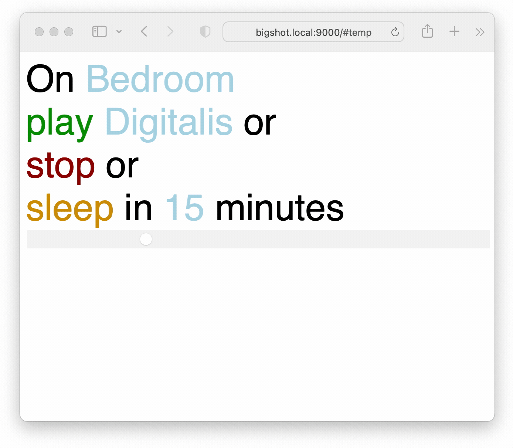

# Not TuneIn

I [whined](https://twitter.com/steingart/status/1555191526229266438) about the jingles and ads that TuneIn inserts into Sonos radio streams, and the seeming inability to pay for them to go away. I then realized that the excellent SoCo library provided an easy workaround to the vibe-killing. 

So as one should, when I whined, I took action, and here's the result. Run this on a network where you've got a sonos, use my [station list](https://docs.google.com/spreadsheets/d/1eCQ94Ur71X0C5-EoPVfuTXJH6f3zYkt1pFmO2872eVs/edit#gid=0) or make your own and edit that one line in `not_tunein.py` appropriately, and you're off.



## Requirements
- Python > 3.7
- Requests 
- SoCo
- flask

Just `python3 -m pip install -r requirements.txt` and you're good.

The station list is a [google sheet](https://docs.google.com/spreadsheets/d/1eCQ94Ur71X0C5-EoPVfuTXJH6f3zYkt1pFmO2872eVs/), thus dynamic listing for stations I'm using. Feel free to use this list. Or fork and make your own. Or just hard code the stations like an animal.

## Usage
Invoke with 
```
python3 not_tunein.py PORT
```
where `PORT` is your desired http port. Defaults to `9000`. Then go to `http://localhost:PORT` or wherever. 

Enjoy.
